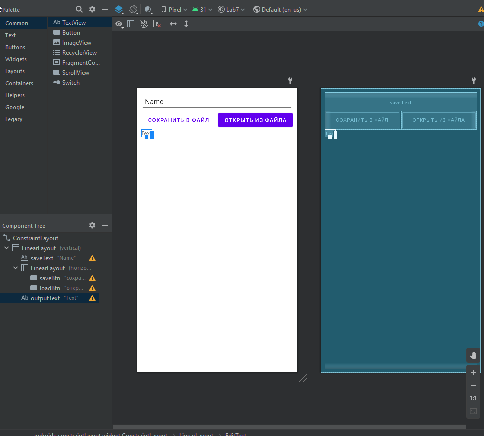
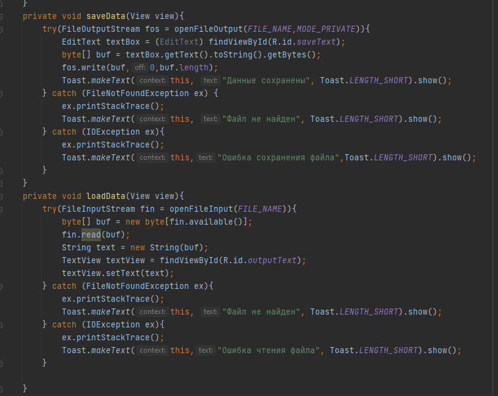
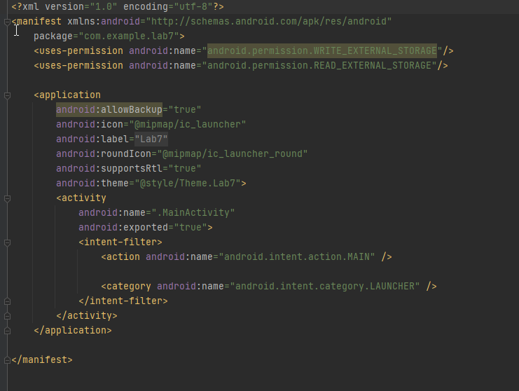
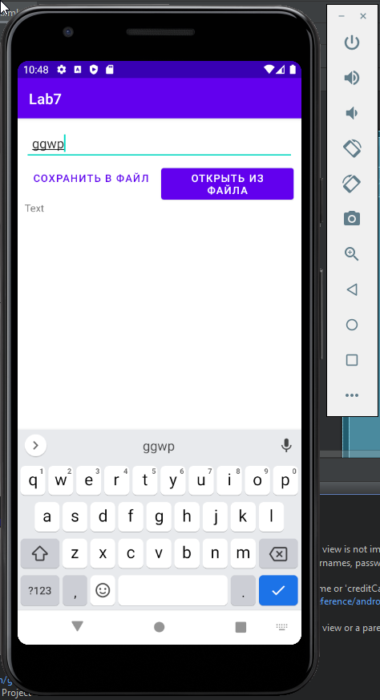
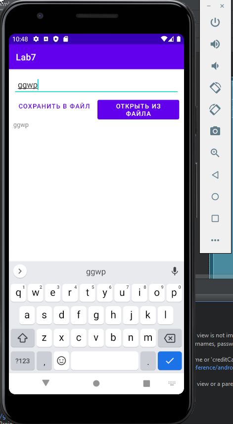

# Лабораторная работа № 7
# Васильев Никита 803в2

## Порядок выполнения:
1.Добавим поля Plain Text, TextView и 2 кнопки.  
  
2. Добавим обработчики кнопок.  
  
3. Добавим разрешения  
  
4. Результат:  

